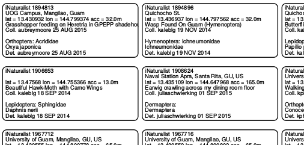

# inat-insect-pin-labels

This repo contains an [iPython notebook](inat-insect-pin-labels-from-inaturalist-project-data.ipynb) which generates [PDF pages of small labels for pinned insect specimens](insect_pin_labels_for-ag-bi-345-f15.pdf) from data stored in
an [iNaturalist project](http://www.inaturalist.org/projects/ag-bi-345-f15).

It was originally developed for my University of Guam entomology students who use an iNaturalist project to catalog their insect collections.

Eventually, I would like to repackage this as a web app where students can print labels for a selected set of observations/specimens. Thinking about using a Django framework.
